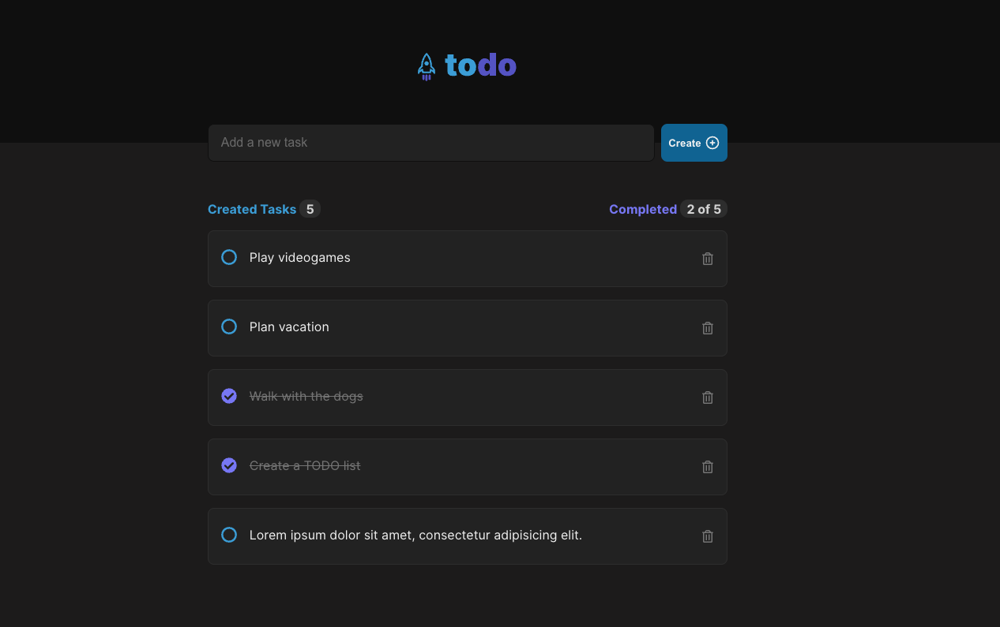

# Todo List React App

A simple and intuitive Todo List application built with React.js. This app helps you manage your tasks efficiently and stay organized.

## Features

-   Add new tasks
-   Mark tasks as completed
-   Delete tasks

## Screen



## Installation

1. Clone the repository:
    ```bash
    git clone https://github.com/augustoaccorsi/todo-list.git
    ```
2. Navigate to the project directory:
    ```bash
    cd todo-list
    ```
3. Install the dependencies:
    ```bash
    npm i
    ```

## Usage

1. Start the development server:
    ```bash
    npm start
    ```
2. Open your browser and go to `http://localhost:3000` to view the app.
